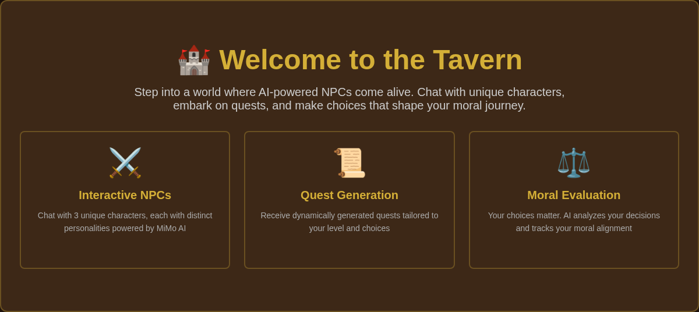
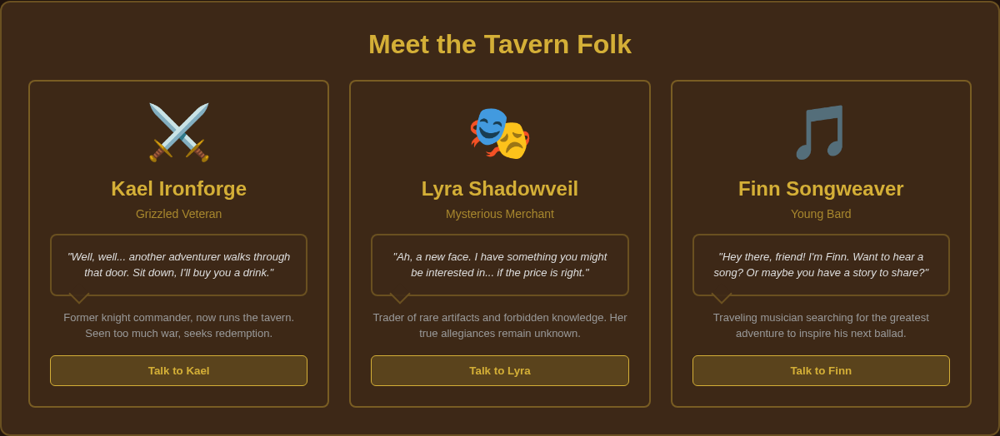
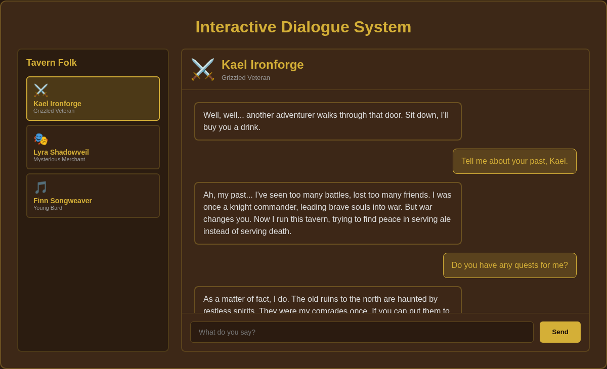
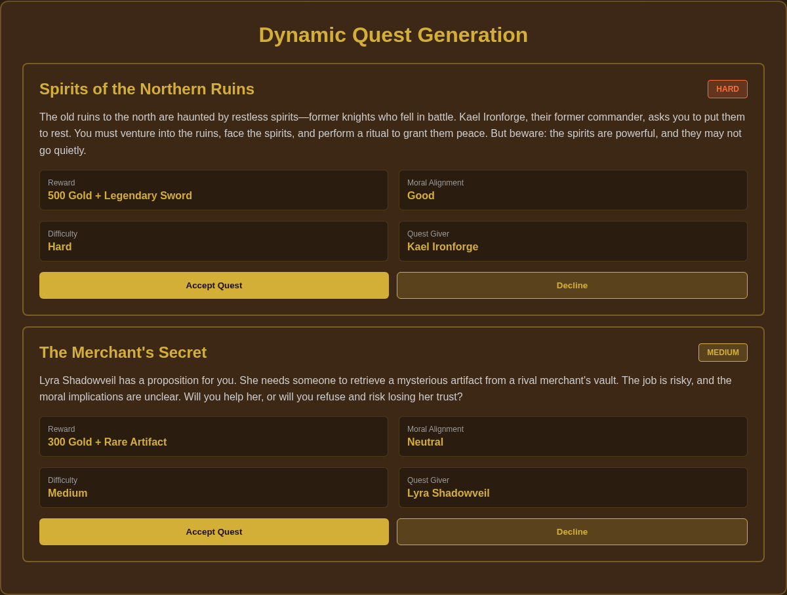
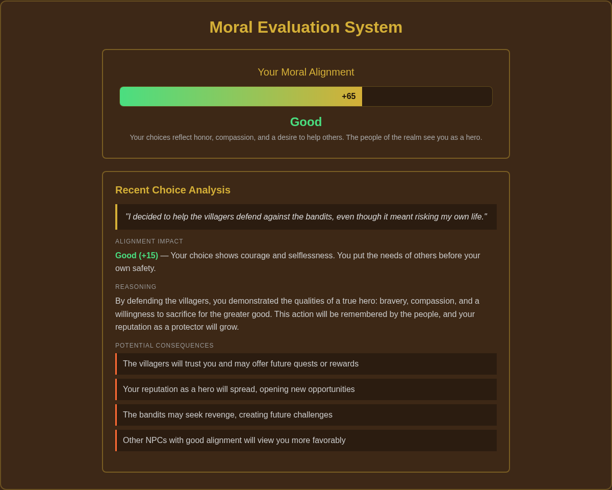

# 🏰 MiMo NPC Tavern

AI-powered fantasy tavern with interactive NPCs, dynamic quest generation, and moral evaluation system.

## ✨ Features

### 🎭 Interactive NPCs
Chat with 3 unique characters, each with distinct personalities powered by **MiMo AI V2.5 Pro**:

- **⚔️ Kael Ironforge** — Grizzled Veteran: Tough, experienced, tells war stories, values honor
- **🎭 Lyra Shadowveil** — Mysterious Merchant: Enigmatic, deals in secrets, speaks in riddles
- **🎵 Finn Songweaver** — Young Bard: Optimistic, curious, loves stories, idealistic but naive

### 📜 Quest Generation
Receive dynamically generated quests tailored to your level and choices. Each quest includes:
- Title and description
- Difficulty rating (easy/medium/hard)
- Rewards
- Moral implications

### ⚖️ Moral Evaluation
Your choices matter. AI analyzes your decisions and tracks your moral alignment:
- Good/Neutral/Evil alignment tracking
- Consequence analysis
- Moral score system (-100 to +100)

## 🚀 Tech Stack

- **Next.js 14** — React framework with App Router
- **TypeScript** — Type-safe development
- **Tailwind CSS** — Utility-first styling with custom tavern theme
- **Zustand** — Lightweight state management
- **MiMo AI V2.5 Pro** — AI-powered dialogue, quest generation, and moral analysis
- **Lucide React** — Beautiful icons

## 📦 Installation

```bash
# Clone repository
git clone https://github.com/yourusername/mimo-npc-tavern.git
cd mimo-npc-tavern

# Install dependencies
npm install

# Set up environment variables
cp .env.example .env.local
# Edit .env.local and add your MiMo API key

# Run development server
npm run dev
```

Open [http://localhost:3000](http://localhost:3000) to see the tavern.

## 🔑 Environment Variables

### Local Development

Create `.env.local` in the project root:

```env
# MiMo AI API (V2.5 Pro)
MIMO_API_KEY=your_mimo_api_key_here
MIMO_API_URL=https://token-plan-sgp.xiaomimomo.com/v1

# Optional: Groq API fallback
GROQ_API_KEY=your_groq_api_key_here
```

**Note:** `.env.local` is ignored by git and only used locally.

### Production Deployment (Netlify)

1. **Push repository to GitHub** (without `.env.local`)
2. **Connect to Netlify:**
   - Go to [netlify.com](https://netlify.com)
   - Click "Add new site" → "Import an existing project"
   - Select your GitHub repository
   - Click "Deploy site"

3. **Add Environment Variables in Netlify:**
   - Go to Site settings → Environment variables
   - Click "Add a variable"
   - Add the following variables:
     - **Key:** `MIMO_API_KEY` | **Value:** Your MiMo API key
     - **Key:** `MIMO_API_URL` | **Value:** `https://token-plan-sgp.xiaomimomo.com/v1`
   - (Optional) Add `GROQ_API_KEY` for fallback

4. **Trigger Redeploy:**
   - After adding environment variables, Netlify will automatically redeploy
   - Or manually trigger: Site settings → Deploys → "Trigger deploy"

5. **Verify Deployment:**
   - Visit your Netlify URL
   - Test NPC dialogue to confirm API integration works
   - Check browser console (F12) for any errors

**Important:** Never commit `.env.local` or API keys to GitHub. Use Netlify dashboard for production secrets.

## 🎮 Usage

1. **Enter the Tavern** — Start from the homepage
2. **Choose an NPC** — Click on any character to begin conversation
3. **Chat** — Type your message and press Enter or click Send
4. **Request Quests** — Ask NPCs for quests or click "Request Quest"
5. **Make Choices** — Your decisions affect your moral alignment

## 📁 Project Structure

```
mimo-npc-tavern/
├── app/
│   ├── api/
│   │   ├── dialogue/route.ts    # NPC dialogue generation
│   │   ├── quest/route.ts       # Quest generation
│   │   └── moral/route.ts       # Moral analysis
│   ├── tavern/page.tsx          # Main tavern chat interface
│   ├── layout.tsx               # Root layout
│   ├── page.tsx                 # Homepage
│   └── globals.css              # Global styles + tavern theme
├── components/
│   ├── ui/                      # Reusable UI components
│   ├── npc/                     # NPC-specific components
│   └── layout/                  # Layout components
├── lib/
│   ├── api/
│   │   └── mimo.ts              # MiMo API integration
│   ├── store.ts                 # Zustand state management
│   └── types.ts                 # TypeScript interfaces
└── public/
    ├── icons/                   # Tavern icons
    └── images/                  # Screenshots and assets
```

## 🎨 Design System

### Colors
- **Tavern Dark** (`#1a0f0a`) — Background
- **Tavern Wood** (`#3d2817`) — Cards and panels
- **Tavern Gold** (`#d4af37`) — Accents and highlights
- **Tavern Fire** (`#ff6b35`) — Call-to-action elements

### Typography
- **Primary Font** — Inter (sans-serif)
- **Medieval Font** — Cinzel (for headers)

## 🛠️ Development

```bash
# Run dev server
npm run dev

# Build for production
npm run build

# Start production server
npm start

# Lint code
npm run lint
```

## 🚢 Deployment

### Netlify (Recommended)
1. Push to GitHub
2. Connect repository to Netlify
3. Add environment variables in Netlify dashboard
4. Deploy

### Vercel
1. Push to GitHub
2. Import repository at [vercel.com/new](https://vercel.com/new)
3. Add environment variables
4. Deploy

### Railway
1. Push to GitHub
2. Create new project at [railway.app](https://railway.app)
3. Connect repository
4. Add environment variables
5. Deploy

## 📝 API Endpoints

### POST `/api/dialogue`
Generate NPC dialogue response.

**Request:**
```json
{
  "npcId": "grizzled-veteran",
  "playerInput": "Tell me about your past",
  "context": "NPC: Kael Ironforge, Role: Grizzled Veteran"
}
```

**Response:**
```json
{
  "npcId": "grizzled-veteran",
  "response": "Ah, my past... I've seen too many battles, lost too many friends.",
  "timestamp": 1716520680186
}
```

### POST `/api/quest`
Generate a new quest.

**Request:**
```json
{
  "npcId": "mysterious-merchant",
  "playerLevel": 5
}
```

**Response:**
```json
{
  "npcId": "mysterious-merchant",
  "quest": "Quest details...",
  "timestamp": 1716520680186
}
```

### POST `/api/moral`
Analyze moral implications of a choice.

**Request:**
```json
{
  "choice": "I decided to help the villagers",
  "context": "Village under attack by bandits"
}
```

**Response:**
```json
{
  "choice": "I decided to help the villagers",
  "analysis": "Alignment: Good. Your choice shows courage...",
  "timestamp": 1716520680186
}
```

## 🤝 Contributing

Contributions welcome! Please:
1. Fork the repository
2. Create a feature branch (`git checkout -b feature/amazing-feature`)
3. Commit changes (`git commit -m 'Add amazing feature'`)
4. Push to branch (`git push origin feature/amazing-feature`)
5. Open a Pull Request

## 📄 License

MIT License - see [LICENSE](LICENSE) file for details.

## 🙏 Acknowledgments

- **MiMo AI** — Powering the AI dialogue and quest generation
- **Next.js Team** — Amazing React framework
- **Tailwind CSS** — Beautiful utility-first CSS

## 📸 Screenshots

### 1. Homepage Hero

*Welcome screen with feature overview and tavern theme*

### 2. NPC Cards

*Three unique NPCs with distinct personalities and backstories*

### 3. Chat Interface

*Interactive dialogue system with AI-powered responses*

### 4. Quest Generation

*Dynamically generated quests with difficulty ratings and moral implications*

### 5. Moral Evaluation

*AI analysis of player choices with alignment tracking and consequences*

## 📧 Contact

Questions or feedback? Open an issue or reach out!

---

**Built with ❤️ for the MiMo AI community**

*A fantasy adventure experience powered by AI*
